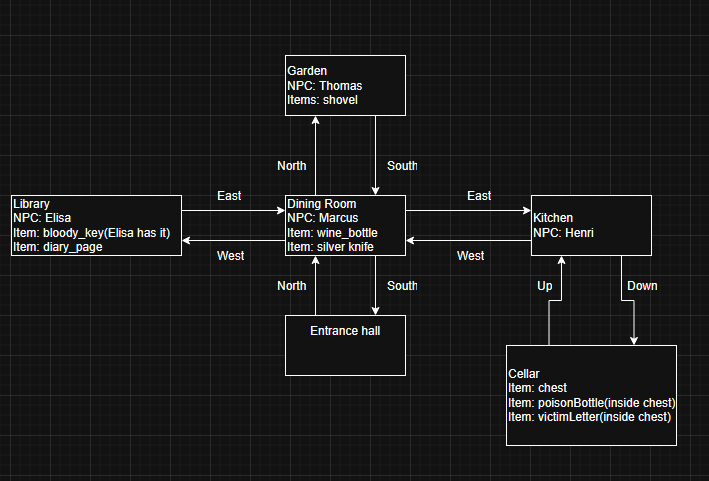

# Zork

## Author
Anuk Guerra Izquierdo

## Repository
https://github.com/YourUsername/Zork

## How I Approached the Zork Game and My Thoughts
Before starting this project, I had never played the original Zork game.  

To better understand the assignment, I first played the original game and tried to understand how it worked. 

At first, it was confusing because I had never played a text adventure game before.

While experimenting with the game, I noticed that Zork is a text-based adventure with a logical world where the player can perform a limited set of actions.

The world changes depending on the player's decisions and interactions. 

I also deduced that the game does not update continuously with time or delta time; instead, the world only changes when the player performs an action.

After understanding the basic concept, I read the Zork structure guide and followed a similar structure while still implementing the systems in my own way.

One thing I did not fully understand from the original Zork was what the game was actually about. Because of that, I decided to create my own interpretation.

I thought that a detective mystery similar to the game Cluedo would fit very well with a text adventure game.

The last thing I did not fully understand about the original Zork game was the actions the player could perform., I managed to discover 3 or 4 of the original game but it was a bit confusing to me.

So I decided to create the actions that I thought were necessary. I think I used pretty straightforward actions. Look, go, take... And I decided to make actions to have 0 or 1 parameter, because it made more sense to me.

As an extra feature, I implemented NPCs that the player can talk to. NPC dialogue changes depending on the evidence and items the player has already discovered.

The assignment also required items to be able to contain other items. To expand this idea further, I decided that NPCs could also contain items. Both items and NPCs inherit from a `Container` class that provides this functionality.

These items and NPCs that can contain objects , can also have a required item to be opened or to trust you and give you what they have.

## How to Play
You can make actions, this actions can contain 0 or 1 parameters or arguments.

Actions:

look -> empty args (looks current room), inventory, NPC, item(shows item info and child items info), available direction in room(shows other room), self/me

go   -> directions(east/west, north/south, up/down)

take -> item(in current scope) (max 2 items. This items can be item containers so you can really move more than 2 items)

drop -> item (in inventory) (drops into current room)

talk -> NPC(name)

open -> item(has to be a container item)(requieres the asociated key to be opened)(drops key when opened)(remains opened)

close-> _(Just closes any opened container)

## How to Finish Game (minimum actions)

--Go to library: go west

--Talk with elisa: talk elisa

--Get the key: take bloody_key

--Go to Entrance Hall: go east

--Go to Kitchen: go east

--Go to cellar: go down

--Open the chest with the key(key gets freed from inventory): open chest

--Take the poison: take poison_bottle

--Inventory is full and you want to take the letter so you drop the detective badge: drop detective_badge

--Now you can take the letter: take letter

--Go Back to the Kitchen: go up

--Go to the Entrance Hall: go west

--Go to the dining room: go north

--You find marcus who is the culprit if you talk with him, and u already have all the evidence that point to him in your inventory you win the game: talk marcus

## Map

## Disclaimer
AI tools were used to help generate some dialogue and descriptions for the game world.

## License
MIT
